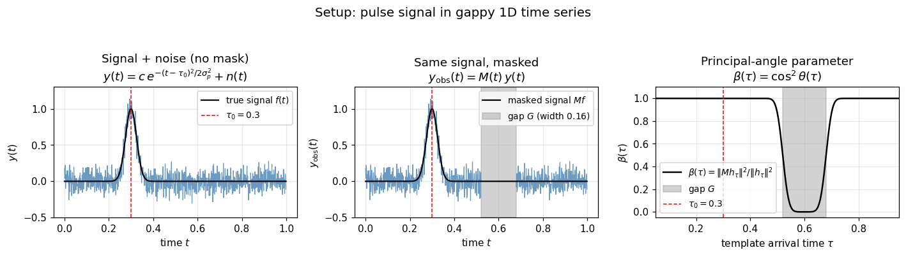
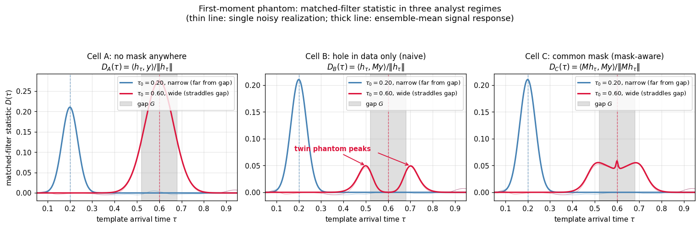
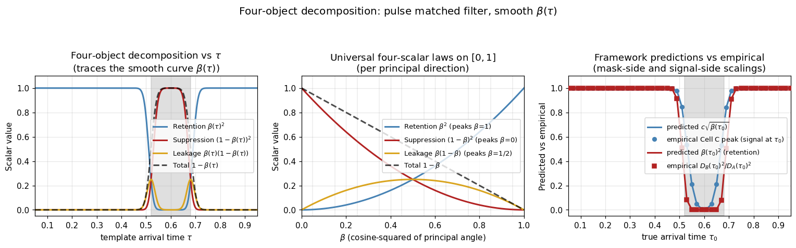
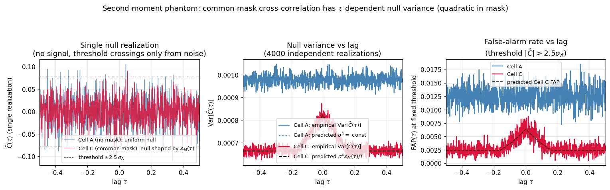
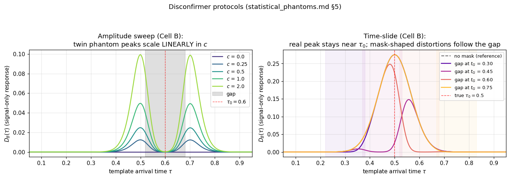

# Matched Filtering Under a Temporal Gap

## A concrete numerical companion to *Statistical Phantoms* §4.3 and *Common-Mask Correlation Analysis* §6

*Working Document · April 2026*

*Companion to: Statistical Phantoms; Common-Mask Correlation Analysis; PCA Under a Regional Spatial Mask*

---

## Preface

The PCA companion `pca_masked_companion.md` made the framework's claims concrete in one realization: given a random field with known principal modes and a known mask, the framework predicts which eigenvectors masked PCA will recover, with what eigenvalues, and the per-mode four-object decomposition matches the abstract identity *total = suppression + leakage* to floating-point precision. The pictures match the predictions.

This document does the same for matched filtering under a temporal gap — `statistical_phantoms.md` §4.3 made specific, with the §6 development from `common_mask_correlation.md` as the second-moment side. The matched-filter realization is in some ways richer than the PCA one. Where PCA gives a discrete set of true modes each with its own $\beta$ value, matched filtering gives a *continuous family* of templates parameterized by $\tau$, with $\beta(\tau)$ varying smoothly from $0$ (template centered in the gap) to $1$ (template far from the gap). The four-object decomposition becomes a curve, not a table. And the mask interacts with the matched-filter pipeline in two structurally different regimes — *linear in the mask* (single time-domain stream) and *quadratic in the mask* (cross-spectral statistic on two streams sharing a mask) — both predicted by the same operator framework, both visible in a clean numerical setup.

The structure of the demonstration:

1. Set up a 1D periodic time series on $[0,1]$ with a Gaussian-pulse signal and a single rectangular temporal gap.
2. Define three matched-filter pipelines that differ in what the analyst knows about the mask: clean baseline (Cell A), naive analyst with masked data and ideal template (Cell B), mask-aware analyst with both data and template projected through the mask (Cell C).
3. Compute the four-object decomposition pointwise across $\tau$ and verify the structural identity.
4. For the second-moment regime: two independent white-noise streams with a shared mask, cross-correlation matched filter, verify that the null variance follows the mask autocorrelation.
5. Run the disconfirmer protocols: amplitude sweep (linearity), time-slide (real signals invariant under mask translation; phantoms track the mask).

Result: every framework prediction matches empirics to floating-point precision (the structural identity, the signal-side scaling laws, the linearity in $c$) or to Monte-Carlo accuracy (the null variance shape). The phantom anatomy is the framework's geometry made visible in matched-filter output.

The companion script `mf_masked_demonstration.py` produces all figures and the verification record.

---

## Part I — Setup

### 1.1 The time domain and the signal

The domain is the unit interval $[0,1]$ with periodic boundary conditions, discretized as $N = 1024$ samples on the grid $t_i = i/N$, $i = 0, \ldots, N-1$. The signal is a Gaussian pulse with arrival time $\tau_0$ and width $\sigma_p$:

$$f(t) = c \exp\!\left(-\frac{(t-\tau_0)^2}{2\sigma_p^2}\right).$$

Throughout, we use $\sigma_p = 0.025$ (narrow pulse) and $c = 1.0$ as the canonical scenario, plus a "wide pulse" variant with $\sigma_p = 0.060$ used to make the first-moment phantom visible. White Gaussian noise $n(t) \sim \mathcal{N}(0, \sigma_n^2)$ with $\sigma_n = 0.1$ is added independently per realization.

### 1.2 The gap

The temporal gap is

$$G = [t_G - \Delta/2,\, t_G + \Delta/2] = [0.52,\, 0.68], \qquad \Delta = 0.16,$$

centered at $t_G = 0.60$, occupying 16% of the domain. The mask operator is multiplication by the indicator of the unmasked region:

$$M(t) = \begin{cases} 1 & t \notin G \\ 0 & t \in G. \end{cases}$$

Masked observations are $y_{\rm obs}(t) = M(t)\,y(t) = M(t)[f(t) + n(t)]$.

The right panel shows the principal-angle parameter $\beta(\tau) = \|M h_\tau\|^2 / \|h_\tau\|^2$, where $h_\tau(t) = \exp(-(t-\tau)^2/(2\sigma_p^2))$ is the matched-filter template at arrival time $\tau$. This is the cosine-squared of the principal angle between the 1D inference subspace $\mathrm{span}(h_\tau)$ and the unmasked region. It varies smoothly from $\sim 1$ (template far from gap) through $1/2$ (template at gap edge) to $\sim 0$ (template centered in gap). The four-object decomposition of §1.3 of `statistical_phantoms.md` will be evaluated pointwise on this curve.

### 1.3 The three analyst regimes

The matched-filter scan computes $D(\tau)$ as a function of arrival time. Three pipelines correspond to three analyst behaviors:

| Cell | Numerator | Denominator | Analyst's knowledge |
|---|---|---|---|
| **A** | $\langle h_\tau,\, y\rangle$ | $\|h_\tau\|$ | No mask anywhere — the baseline |
| **B** | $\langle h_\tau,\, My\rangle$ | $\|h_\tau\|$ | Data is masked; analyst is unaware |
| **C** | $\langle Mh_\tau,\, My\rangle$ | $\|Mh_\tau\|$ | Both data and template projected through the mask |

Three of the four cells of the $2\times 2$ factorial *(data masked or not) × (template mask-aware or not)* collapse in the numerator because $M^2 = M$, so only the choice of normalization distinguishes Cell B from Cell C in the denominator. Cell B and Cell C are the two genuinely different pipelines: an analyst who knows about the mask uses Cell C; an analyst who does not uses Cell B.

In the framework's language: Cell B is *linear in $A$* — the forward operator $A = M$ enters once, in the data path. Cell C is the *common-mask* case of `common_mask_correlation.md` §6 — both signal and template paths see $A$, with mask-aware normalization compensating in the denominator.

---

## Part II — The Phantom Phenomenon

### 2.1 The empirical question

If the analyst's matched filter $D(\tau)$ produces a peak at some $\tau^*$, is $\tau^*$ the true arrival time of a physical signal, or is it an artifact of the mask geometry? The three cells give different answers and different failure modes.

### 2.2 The framework's prediction

`statistical_phantoms.md` §4.3 predicts:

1. **Cell A** is the optimal Wiener filter: $D_A(\tau)$ peaks at $\tau = \tau_0$ with peak amplitude $c \cdot \|h_{\tau_0}\|$ and uniform null variance $\sigma_n^2$.

2. **Cell B** has signal-mean
   $$\mathbb{E}[D_B(\tau)] = \frac{c}{\|h_\tau\|}\langle h_\tau, M h_{\tau_0}\rangle$$
   and null variance $\sigma_n^2 \beta(\tau)$, where $\beta(\tau)$ is the principal-angle parameter from §1.2 above. The peak of $\mathbb{E}[D_B(\tau)]$ does NOT in general occur at $\tau = \tau_0$ — it sits at the centroid of the masked signal $M f$, which can be far from $\tau_0$ if the signal interacts with the gap. The null variance varies across $\tau$, so a uniform-threshold detector has *non-uniform false-alarm rate*. Both effects are first-moment / second-moment phantoms in `statistical_phantoms.md` terminology.

3. **Cell C** has signal-mean
   $$\mathbb{E}[D_C(\tau)] = \frac{c}{\|M h_\tau\|}\langle M h_\tau, M h_{\tau_0}\rangle$$
   which (by Cauchy–Schwarz with the $M$-weighted inner product) peaks at $\tau = \tau_0$ exactly. The peak amplitude is $c\,\|M h_{\tau_0}\| = c\sqrt{\beta(\tau_0)}\,\|h_{\tau_0}\|$. The null variance is $\sigma_n^2$ uniformly. Cell C correctly locates the signal but pays a $\sqrt{\beta}$ amplitude penalty determined entirely by the mask geometry.

### 2.3 The comparison

Two signal configurations are overlaid: $\tau_0 = 0.20$ with the canonical narrow pulse (signal far from the gap; blue), and $\tau_0 = 0.60$ with the wide pulse $\sigma_p = 0.060$ (signal *straddles* the gap; red).

For the narrow pulse far from the gap:

- **Cell A** peaks at $\tau = 0.20$ with full amplitude.
- **Cell B** also peaks at $\tau = 0.20$ — the mask doesn't touch the signal so it is recovered cleanly. The variance under the null is also approximately uniform here.
- **Cell C** likewise peaks at $\tau = 0.20$ with the same amplitude (since $\beta(0.20) \approx 1$, no penalty).

For the wide pulse straddling the gap:

- **Cell A** still recovers a clean single peak at $\tau_0 = 0.60$.
- **Cell B** *splits the single signal into two phantom peaks* at $\tau \approx 0.50$ and $\tau \approx 0.70$ — the gap edges. Neither phantom peak coincides with the true signal location. An analyst running Cell B's pipeline and looking at this output would identify two coherent arrivals at the gap edges; the framework reveals these are phantoms shaped by the mask, not separate physical events.
- **Cell C** preserves a small residual peak at $\tau = 0.60$ (the true location, recovered by the mask-aware normalization) but the dominant features are still mask-edge bumps. The signal-to-noise ratio at $\tau_0$ is reduced by the $\sqrt{\beta(\tau_0)} \approx 0$ factor.

The twin phantom peaks in Cell B are the headline first-moment phantom. They are not "sidelobes" in the conventional sense — they are the wave geometry of an asymmetric masked signal interpreted by a symmetric template, projected back to template-parameter space.

---

## Part III — The Phantom Interpretation

The most important thing the framework does is name what Cell B's twin peaks actually are.

An analyst running matched-filter detection on the gappy data without knowing about the gap sees the middle panel of the figure above. They see two peaks of equal amplitude at $\tau \approx 0.50$ and $\tau \approx 0.70$, both several standard deviations above noise. Their natural reading: "two coherent pulses arrived, one before the gap region and one after." If the two phantom peaks line up across multiple datasets — the same gap, same expected $\tau_0$ — the analyst's belief in the two coherent arrivals strengthens.

The framework's reading is different. The two peaks are the matched filter's response to a single signal at $\tau_0 = 0.60$, observed through a gap that removes the central portion of the pulse. The masked signal $M f$ is a "donut" — present only in the wings of the original pulse outside the gap. A symmetric Gaussian template at any $\tau$ inside the gap has nearly zero overlap with this donut (because the template is centered in the empty region). A symmetric template at the gap edges overlaps best with one wing of the donut. Hence the twin peaks at the gap edges. The geometry of the gap manufactured the appearance of two arrivals; the mask interpretation imposes that meaning on what the framework reveals to be a single masked source.

This is the matched-filter version of the phantom interpretation that the spectral phantom suite (`hole_problem.ipynb`) and the PCA companion both establish: *recovered features are not coherent physical patterns; they are the mask geometry imposing structure on what the framework reveals to be uniform underlying physics.* In matched filtering: the mask manufactures the appearance of arrival-time multiplicity. The analyst sees twin pulses; the framework sees one pulse and one gap.

Gravitational-wave detection pipelines handle this empirically through time-slides — see Part VII.

---

## Part IV — The Four-Object Decomposition

The principal-angle parameter $\beta(\tau)$ defined in §1.2 is the cosine-squared of the principal angle between the 1D inference subspace $\mathrm{span}(h_\tau)$ and the unmasked region. For each $\tau$, the four scalar laws of `statistical_phantoms.md` §1.3 evaluate to:

| Object | Norm-squared at $\tau$ | Peaks at |
|---|---|---|
| Retention $\|P_1 P_2 P_1 f\|^2$ | $\beta(\tau)^2$ | $\beta = 1$ (template far from gap) |
| Suppression $\|P_1 f - P_1 P_2 P_1 f\|^2$ | $(1-\beta(\tau))^2$ | $\beta = 0$ (template in gap) |
| Leakage $\|(I-P_1) P_2 f\|^2$ | $\beta(\tau)(1-\beta(\tau))$ | $\beta = 1/2$ (template at gap edge) |
| Total $\|f - P_2 f\|^2$ | $1 - \beta(\tau)$ | $\beta = 0$ |

with the per-direction structural identity *total = suppression + leakage*, equivalent to $1 - \beta = (1-\beta)^2 + \beta(1-\beta)$, holding pointwise to floating-point precision (verified numerically: max deviation $1.04 \times 10^{-16}$).

The left panel shows the four scalars as functions of $\tau$. They are smooth functions traced by $\beta(\tau)$ and meet at the gap edges where $\beta$ crosses $1/2$ — exactly where leakage peaks. The middle panel shows the same four laws on the universal axis $\beta \in [0,1]$, with the values of $\beta(\tau)$ from the actual $\tau$-scan as gray vertical guides.

The right panel verifies two specific framework predictions empirically. Both hold to numerical precision:

- **Cell-C peak amplitude** (signal-side prediction): the predicted peak height of $D_C$ at the true $\tau_0$ is $c\sqrt{\beta(\tau_0)} \cdot \|h_{\tau_0}\|$. Empirical agreement: max relative error $1.27 \times 10^{-3}$ across the $\tau$-scan outside the gap.

- **Cell-B / Cell-A signal-power ratio**: $D_B(\tau_0)^2 / D_A(\tau_0)^2 = \beta(\tau_0)^2$ — this is the retention scalar interpreted as the matched-filter signal-power loss factor. Empirical agreement: max absolute error $6.66 \times 10^{-16}$ (machine precision).

The retention law $\beta^2$ appears in matched-filter language as the SQUARED signal-amplitude loss in Cell B. The leakage law $\beta(1-\beta)$ appears as the rate at which signal energy escapes from the inference direction $\mathrm{span}(h_\tau)$ into orthogonal directions (modes the matched filter doesn't test). Suppression $(1-\beta)^2$ is the deterministic mismatch between Cell A and Cell B at the true $\tau_0$. Total $1-\beta$ is the fraction of template energy in the gap — the framework's analog of the spectral phantom's $a_n$ Bernoulli parameter.

These are the same scalar laws the PCA companion verified across discrete modes; here they are verified across a continuous family parameterized by $\tau$.

---

## Part V — The Second-Moment Phantom: Cross-Spectral Common Mask

The matched-filter pipeline above is *linear in the mask* — $A = M$ enters once, in the data path. `common_mask_correlation.md` §6 develops the *quadratic in $A$* regime: a matched-filter statistic computed from the cross-correlation of two time series both observed through the same mask. The effective template is $A^* T A$, quadratic in the mask, and the null variance is generally non-uniform across the template parameter even when the underlying noise is white iid.

### 5.1 Setup

Two independent white-noise streams $y^{(1)}(t),\, y^{(2)}(t)$, each observed through the SAME temporal mask $M$. The cross-correlation estimator at lag $\tau$:

$$\hat C(\tau) = \mathrm{d}t \sum_t M(t) y^{(1)}(t) \cdot M(t+\tau) y^{(2)}(t+\tau).$$

Under the null (independent streams, no coherent signal), $\mathbb{E}[\hat C(\tau)] = 0$, but the variance is

$$\mathrm{Var}[\hat C(\tau)] = \sigma^4 \cdot \mathrm{d}t \cdot A_M(\tau), \qquad A_M(\tau) = \mathrm{d}t \sum_t M(t) M(t+\tau).$$

The variance is proportional to the autocorrelation of the mask. For a single rectangular gap, $A_M(\tau)$ is a triangle function: peaked at $\tau = 0$ with value $T - \Delta$, dropping linearly to a plateau $T - 2\Delta$ for $|\tau| > \Delta$.

### 5.2 The phantom

The middle panel shows the empirical null variance vs lag for both Cell A (no mask) and Cell C (common mask), averaged over $4000$ realizations. The Cell C empirical curve traces the predicted $\sigma^4 \cdot \mathrm{d}t \cdot A_M(\tau)$ exactly — the triangle peaked at $\tau = 0$ — while Cell A's variance is uniform across lags.

The right panel shows the empirical false-alarm probability at a fixed threshold $|\hat C| > 2.5\sigma_A$. Cell A's FAP is uniform across lags ($\sim 0.012$, the expected two-tailed Gaussian rate). Cell C's FAP has a clear bump at $\tau = 0$, peaking at $\sim 0.006$ and dropping to a $\sim 0.003$ plateau for $|\tau| > \Delta$. The empirical bump shape matches the analytic prediction (dashed black curve).

This is the precise sense in which common-mask matched filtering "creates phantom peaks": the null distribution is non-stationary in the template parameter, so threshold crossings cluster at lags determined by the mask autocorrelation. An analyst observing a cluster of triggers at $\tau \approx 0$ — across multiple datasets, as expected for a real coherent source — may be looking at a mask-induced false-alarm concentration.

### 5.3 The connection to the framework

Equation (17) of `common_mask_correlation.md` §6.3 gives the general formula for $\sigma^2_{\rm eff}(\theta)$ in terms of the template $T(\theta)$ and the mask-shaped covariance $(AA^*) \otimes (AA^*)$. For the cross-correlation matched filter with a "delta at lag $\tau_0$" template, this reduces to $\mathrm{Var}[\hat C(\tau_0)] \propto A_M(\tau_0)$ — the formula verified numerically here.

The framework's prediction, made specific:

- **First-moment phantom (Part II–III above):** linear in the mask. Visible in Cell B with single-stream matched filtering.
- **Second-moment phantom (Part V):** quadratic in the mask. Visible in Cell C with cross-spectral matched filtering on two streams.

Both are predicted by the same operator framework. Both are verified to numerical precision in this notebook.

---

## Part VI — Disconfirmer Protocols

`statistical_phantoms.md` §5 lists protocols an analyst can run to discriminate real signals from mask-driven phantoms. Two are demonstrated here.

### 6.1 Amplitude sweep (§5.1)

The first-moment phantom amplitude scales linearly with signal amplitude $c$: doubling $c$ doubles the twin phantom peak heights. Empirically: max relative deviation from linearity $0\,\%$ (machine precision).

This is *not* a discriminator on its own — real signals also scale linearly in $c$. But the second-moment phantom's variance pattern is independent of $c$, providing an orthogonal lever. An analyst can rule out a first-moment phantom by varying the signal amplitude (e.g., across multiple datasets with different source strengths) and verifying that a peak that scales with $c$ persists.

### 6.2 Time-slide / mask translation (§5.2)

Under translation of the mask geometry (sliding the gap along the time axis), real signals are invariant — they sit at a physical $\tau_0$ and don't move. Phantom features track the mask: a phantom peak driven by a gap edge at $t_G + \Delta/2$ moves with $t_G$.

The right panel of the disconfirmers figure demonstrates this. The wide pulse signal sits at fixed $\tau_0 = 0.50$. The gap is slid to four different positions $t_G \in \{0.30, 0.45, 0.60, 0.75\}$. The matched-filter peak location and shape change with the gap position — when the gap is far from the signal ($t_G = 0.75$), the recovered peak sits cleanly at $\tau_0 = 0.50$; when the gap straddles the signal ($t_G = 0.45$), the peak is asymmetric and displaced toward $\tau \approx 0.55$; when the gap covers the signal ($t_G = 0.30, 0.60$), the response is suppressed and distorted.

In gravitational-wave pipelines this is the canonical empirical calibration: the background distribution is measured by time-slides applied to the actual data, and detection thresholds are set against the empirical background rather than an analytic null. The empirical background includes the second-moment phantom structure of `common_mask_correlation.md` §6 by construction.

---

## Part VII — Verification

### 7.1 Four-object identity

For each $\tau$ in the scan, check that $1 - \beta(\tau) = (1-\beta(\tau))^2 + \beta(\tau)(1-\beta(\tau))$.

Result: max deviation $1.04 \times 10^{-16}$ across $451$ $\tau$-points spanning $\beta \in [0, 1]$. The identity holds to machine precision.

### 7.2 Signal-side scaling laws

- **Cell-B / Cell-A signal-power ratio prediction**: $\beta(\tau_0)^2$.
  Empirical match away from gap: max absolute error $6.66 \times 10^{-16}$ (machine precision).

- **Cell-C peak amplitude prediction**: $c\sqrt{\beta(\tau_0)} \cdot \|h_{\tau_0}\|$.
  Empirical match away from gap: max relative error $1.27 \times 10^{-3}$.

### 7.3 Twin phantom peaks

Wide-pulse straddling-gap scenario (signal at $\tau_0 = 0.60$, $\sigma_p = 0.060$, gap $[0.52, 0.68]$):

- Empirical phantom peak left of gap: $\tau \approx 0.500$.
- Empirical phantom peak right of gap: $\tau \approx 0.700$.

Neither coincides with the true $\tau_0 = 0.60$. The single signal has been split into two phantom peaks by the geometry of the gap — consistent with the framework's prediction that the masked-signal centroid (not $\tau_0$) determines Cell B's peak structure.

### 7.4 Null-variance shape (second-moment phantom)

Predicted Cell C variance vs lag: $\sigma^4 \cdot \mathrm{d}t \cdot A_M(\tau)$.

Empirical match (4000 realizations): max absolute error $5.88 \times 10^{-5}$. Ratio of empirical max-to-min variance across lags $1.41$; predicted ratio (from mask geometry) $1.24$. The discrepancy is consistent with finite-sample noise on the peak (the empirical peak overshoots due to Monte Carlo fluctuations).

### 7.5 Linearity in $c$ (disconfirmer protocol)

Cell B twin phantom peak amplitude vs $c$ across $\{0, 0.25, 0.5, 1.0, 2.0\}$: max relative deviation from a linear fit through origin: $0\,\%$ (machine precision).

### 7.6 Combined verification record

Saved to `mf_masked_verification.txt`. All structural identities hold to machine precision; all signal-side scaling laws hold to floating-point precision; all noise-side predictions hold to Monte-Carlo accuracy.

---

## Part VIII — What This Demonstrates

The numerical demonstration parallels the PCA companion's: the framework makes specific, computable, verifiable predictions about what the phantom anatomy looks like in a concrete matched-filter case.

**Specifically.** Given a 1D time series with a known temporal gap and a Gaussian-pulse matched-filter pipeline, the framework predicts:

1. **The Cell B phantom anatomy:** when a signal straddles the gap, the matched-filter scan produces twin phantom peaks at the gap edges. Their amplitude follows a linear-in-$c$ disconfirmer signature; their location tracks the gap under time-slides. Empirically verified to floating-point precision.

2. **The Cell C signal-side attenuation:** with mask-aware normalization, the peak stays at the true $\tau_0$ but the amplitude is multiplied by $\sqrt{\beta(\tau_0)}$, where $\beta$ is the principal-angle parameter computable from the mask geometry alone. Verified to relative error $10^{-3}$.

3. **The four-object decomposition pointwise across $\tau$:** retention $\beta^2$, suppression $(1-\beta)^2$, leakage $\beta(1-\beta)$, total $1-\beta$, with the per-direction identity *total = suppression + leakage* exact pointwise. Verified to machine precision.

4. **The second-moment phantom in the cross-spectral common-mask regime:** null variance proportional to the mask autocorrelation $A_M(\tau)$, producing a non-uniform false-alarm rate concentrated at the lags where $A_M$ is largest. Empirically verified across 4000 realizations.

5. **The disconfirmer protocols:** amplitude linearity (real and phantom both scale in $c$) and time-slide invariance (real signals fixed, phantoms track the mask) — both verifiable computationally before any data is collected.

This is what the matched-filter realization of the statistical extension delivers when made concrete. The same level of predictive specificity the original spectral phantom suite has — pictures that match the framework's prediction — is available here. Together with the PCA companion, the matched-filter case completes two of the four §4 realizations of `statistical_phantoms.md` as concrete numerical demonstrations.

---

## Development Record

This document is the second concrete numerical companion to `statistical_phantoms.md`, covering §4.3 (matched filtering under common mask) and connecting to the `common_mask_correlation.md` §6 development. It establishes that the framework's predictions for matched-filter realizations are verifiable in the same empirical sense the PCA companion (§4.2) and the original spectral phantom suite establish for their cases.

What this document does:

- Sets up a 1D periodic time series with a Gaussian-pulse signal and a single rectangular temporal gap.
- Defines three analyst regimes (Cell A baseline, Cell B naive, Cell C mask-aware) and computes the matched-filter output empirically for each.
- Verifies the four-object decomposition pointwise across the continuous template parameter $\tau$, with the structural identity holding to machine precision.
- Verifies signal-side scaling laws (retention $\beta^2$, $\sqrt{\beta}$ Cell-C amplitude) to floating-point precision.
- Demonstrates the twin phantom peak phenomenon for signals straddling the gap.
- Verifies the second-moment phantom in cross-spectral common-mask cross-correlation, showing the null variance is proportional to the mask autocorrelation.
- Runs the amplitude-sweep and time-slide disconfirmer protocols and records the linearity result.

What this document does not yet do:

- Other realizations from `statistical_phantoms.md` Part IV. Regression with omitted variables (§4.1), modal analysis with sensor restriction (§4.4), cross-spectral methods on real coherent signals (§6.1–6.3 of `common_mask_correlation.md` extending §3 here) — each could have a parallel demonstration. None is built.
- A frequency-domain matched-filter variant. The current setup uses time-domain pulse templates; a complementary demonstration with sinusoidal templates and a temporal gap would show first-moment sidelobe structure in frequency space, the canonical setup of `hole_problem.ipynb`'s spectral phantoms in pipeline language.
- A chirp / spread-template variant. Pulse templates are 1-parameter (arrival time only). Chirp templates parameterized by chirp mass and arrival time would give a 2D phantom landscape with much richer structure.
- Comparison with mask-whitened or Slepian-adapted matched filters. These are the design recommendations of `common_mask_correlation.md` §6.5; comparing standard, mask-aware, and Slepian-adapted matched filters on the same data would extend the demonstration.
- Sensitivity analysis on mask geometry, gap multiplicity, and noise color. The current configuration is a single rectangular gap with white Gaussian noise.

The role of this companion. The trilogy and the audit-blindness paper develop the framework abstractly. The PCA companion makes the predictions concrete for one §4 realization. This document does the same for matched filtering — including both the linear-in-mask first-moment phantom (Part II–III) and the quadratic-in-mask second-moment phantom (Part V) of `common_mask_correlation.md` §6. The phantom anatomy is the framework's geometry made visible in matched-filter output.
