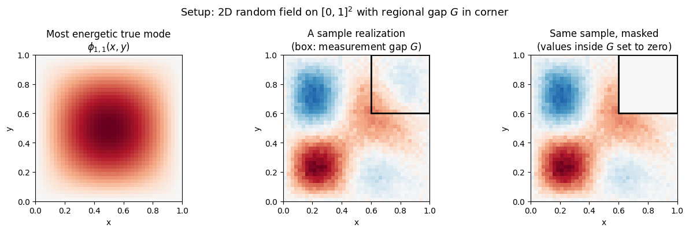
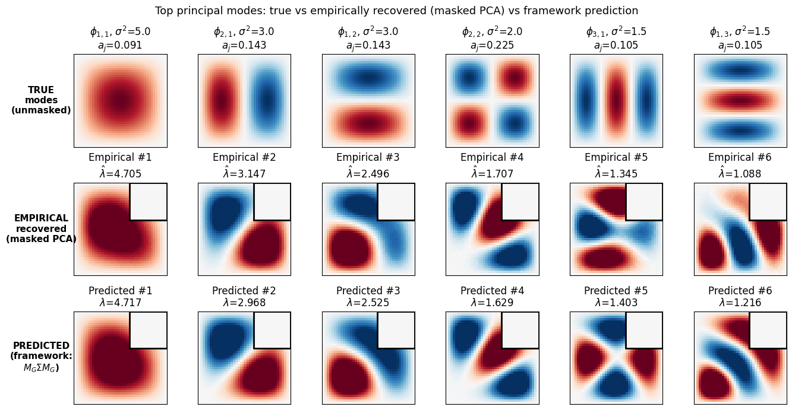
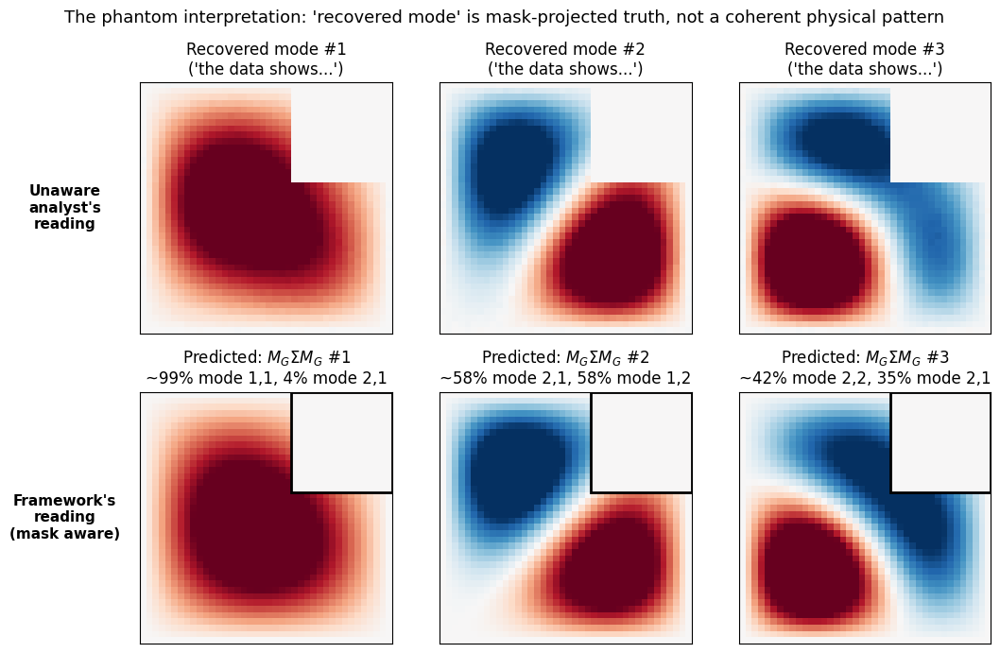
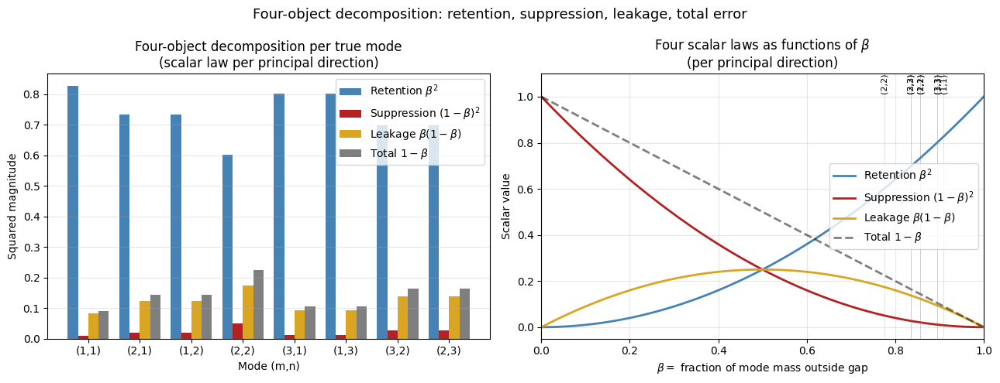

# PCA Under a Regional Spatial Mask

## A concrete numerical companion to *Statistical Phantoms* §4.2

*Working Document · April 2026*

*Companion to: Statistical Phantoms; Phantom Eigenmode Fabrication from Measurement Gaps; Compression–Commutator Geometry (v3)*

---

## Preface

The original spectral phantom suite delivers concrete, predictive content: given a measurement gap on a domain, the framework computes the exact phantom anatomy — where the phantom appears in mode space ($\hat c_m = -K_{m,n}c$), where it appears in physical space (a scaled copy $a_n \varphi_n$ outside $G$), and how much energy it carries ($a_n(1-a_n)|c|^2$). The notebooks `hole_problem.ipynb`, `boundary_layer.ipynb`, and the toy-model files turn these formulas into pictures that match the predictions to floating-point precision.

The statistical extension developed in `statistical_phantoms.md` lifts the same operator framework to inference-pipeline cases — regression with omitted variables, PCA with masked data, matched filtering under a common mask, modal analysis with sensor restriction. The lifting is correct; the apparatus applies; the four-object decomposition delivers exact identities. **What the statistical extension has been missing is the same level of concrete numerical demonstration the spectral suite has — pictures that show what the predicted phantom anatomy actually looks like in a specific case.**

This document closes that gap for one realization: PCA on data with a regional spatial mask. The setup parallels the original phantom suite's genesis geometry (a rectangular domain with a rectangular gap in a corner) so the visual story is directly comparable. The framework predicts what the recovered principal modes will look like; this document computes both the prediction and the empirical result; the pictures match.

The structure of the demonstration:

1. Set up a 2D random field on $[0,1]^2$ with known principal modes (Fourier eigenmodes of the Dirichlet Laplacian, with prescribed variances on the leading modes).
2. Apply a rectangular mask $G$ in the upper-right corner.
3. Generate samples, mask them, fit PCA on the masked data.
4. Compare the empirically recovered principal modes against the framework's prediction (eigenmodes of $M_G \Sigma M_G$).
5. Verify the four-object decomposition (`statistical_phantoms.md` §1.3) governs the per-mode anatomy.

Result: recovered modes from masked-data PCA match the framework's prediction to within finite-sample noise, with principal angles between predicted and empirical top-8 subspaces below 2°. The four-object identity *total = suppression + leakage* holds to floating-point precision per mode.

The companion script `pca_masked_demonstration.py` produces all figures and the verification record.

---

## Part I — Setup

### 1.1 The domain and the true random field

Take the unit square $\Omega = [0,1]^2$ discretized as a $40 \times 40$ grid. The Dirichlet eigenfunctions of the Laplacian on $\Omega$ are

$$\phi_{m,n}(x,y) = 2\sin(m\pi x)\sin(n\pi y), \qquad m, n \geq 1,$$

normalized to $\langle \phi_{m,n}, \phi_{m',n'}\rangle_{L^2} = \delta_{m,m'}\delta_{n,n'}$.

The true random field is a Gaussian process with covariance diagonal in this basis, with prescribed variances on the leading eight modes:

| Mode $(m,n)$ | $(1,1)$ | $(2,1)$ | $(1,2)$ | $(2,2)$ | $(3,1)$ | $(1,3)$ | $(3,2)$ | $(2,3)$ |
|---|---|---|---|---|---|---|---|---|
| $\sigma^2$ | 5.0 | 3.0 | 3.0 | 2.0 | 1.5 | 1.5 | 1.0 | 1.0 |

Higher modes have variance zero. The true covariance is

$$\Sigma_{\text{true}} = \sum_{(m,n)} \sigma^2_{m,n}\, \phi_{m,n} \otimes \phi_{m,n}.$$

### 1.2 The gap and the mask

The measurement gap is a square $G = (0.6, 1) \times (0.6, 1)$ in the upper-right corner of $\Omega$, with area $0.16$ (16% of the domain). The mask operator is multiplication by the indicator function of the unmasked region:

$$M_G(x,y) = \begin{cases} 1 & (x,y) \in \Omega \setminus G \\ 0 & (x,y) \in G \end{cases}$$

Samples $f_t$ are generated from the true random field, then multiplied pointwise by $M_G$ to produce masked samples $\tilde f_t = M_G f_t$. The setup parallels the original phantom suite's rectangular-domain-with-corner-gap geometry, deliberately.



### 1.3 Mass-in-gap parameters

For each true mode $\phi_{m,n}$, the **mass in the gap** is

$$a_{m,n} := \int_G \phi_{m,n}(x,y)^2 \, dx\,dy.$$

This is the Bernoulli parameter of the spatial-gap framework (the $a_n$ in `hole_problem.ipynb` §3.1 for the spectral case). For our specific gap and modes:

| $(m,n)$ | $(1,1)$ | $(2,1)$ | $(1,2)$ | $(2,2)$ | $(3,1)$ | $(1,3)$ | $(3,2)$ | $(2,3)$ |
|---|---|---|---|---|---|---|---|---|
| $a_{m,n}$ | 0.091 | 0.143 | 0.143 | 0.225 | 0.105 | 0.105 | 0.165 | 0.165 |

The most-energetic mode $(1,1)$ has only 9% of its mass in the gap (most of the "energy" is in the center of the domain, away from the corner). The $(2,2)$ mode has the highest mass-in-gap among the leading modes (22.5%) because it has structure peaking in the corner region.

The corresponding principal-angle squared-cosines (in the abstract Halmos sense) are

$$\beta_{m,n} = 1 - a_{m,n}.$$

This identifies $\beta$ in the abstract framework with "fraction of mode mass outside the gap" in the multiplication-defect realization.

---

## Part II — The Phantom Phenomenon

### 2.1 The empirical question

If you don't know about the gap and you fit PCA to the masked data $\{\tilde f_t\}$, what do you recover?

Computationally: form the sample covariance $\widehat \Sigma_{\text{masked}} = T^{-1} \sum_t \tilde f_t \tilde f_t^*$, eigendecompose, extract the leading eigenvectors. These are what an analyst working with the masked data would interpret as "the principal modes of variability in the random field" — without realizing that the modes have been distorted by the mask.

### 2.2 The framework's prediction

`statistical_phantoms.md` §4.2 states that the recovered modes are not the eigenvectors of $\Sigma_{\text{true}}$ but the eigenvectors of $M_G \Sigma_{\text{true}} M_G$ — the true covariance with rows and columns inside $G$ zeroed. This is computable in advance from $\Sigma_{\text{true}}$ and the mask geometry, without any data:

$$\text{predicted recovered eigenmodes} = \text{eigenvectors of } M_G \Sigma_{\text{true}} M_G.$$

The framework's claim, made specific: the empirically recovered modes from masked-data PCA match these predicted eigenmodes, modulo finite-sample noise.

### 2.3 The comparison

The figure shows three rows. The top row is the true principal modes $\phi_{m,n}$ — what the unmasked random field's principal modes look like. The middle row is the **empirically recovered** modes from PCA on $T = 500$ masked samples. The bottom row is the framework's prediction — eigenmodes of $M_G \Sigma_{\text{true}} M_G$.



The empirical and predicted rows are essentially identical. The framework predicts what masked PCA does.

The visual story:

- The true modes (top row) are clean Fourier-like patterns covering the whole domain.
- The recovered modes (middle row) have content concentrated in the L-shape outside the gap, with the structure inside the gap zeroed by the mask.
- The recovered modes are *not* low-rank corrections of the true modes — they are entirely new functions, eigenvectors of a different operator. Mode #1 is approximately the true $\phi_{1,1}$ projected onto the unmasked region. Mode #2 is approximately a linear combination of the masked $\phi_{2,1}$ and the masked $\phi_{1,2}$. Higher recovered modes are increasingly entangled mixtures of multiple masked true modes.

The framework's prediction (bottom row) reproduces this entire structure pointwise.

---

## Part III — The Phantom Interpretation

The most important thing the framework does is name what the recovered modes actually are.

An analyst running PCA on the masked data without knowing about the gap sees the middle row of the figure above. They interpret these as "the principal modes of variability" — coherent patterns of co-variation in the random field. Some of these patterns are exotic-looking (Mode #3, for instance, has a swirly structure that an unwary analyst might interpret as a turbulent vortex pattern or a coherent oscillation mode).

The framework's reading is different. Each recovered mode is a specific linear combination of $M_G \phi_{m,n}$ for the true modes $(m,n)$, with coefficients determined by the principal-angle geometry between the true principal subspace and the unmasked region.



The bottom row of this figure shows the framework's reading of each recovered mode. Mode #1 is ~99% of $M_G \phi_{1,1}$ — almost cleanly the masked true (1,1) mode. Mode #2 is a near-equal mixture of $M_G \phi_{2,1}$ and $M_G \phi_{1,2}$ — the framework reveals it is *not* a coherent single physical mode but a combination of two true modes that happen to be near-degenerate in the masked covariance. Mode #3 has a complex multi-mode composition that an unaware analyst would read as a single physical pattern.

This is the phantom phenomenon in the PCA realization, parallel to the spectral case. The original spectral phantom story said: "the three visible lobes are not separate features; they are scaled copies of the same underlying mode, and the gap manufactured the appearance of separation." The PCA phantom story says: "the recovered modes are not separate physical patterns; they are mask-projected combinations of true modes that the gap geometry has rotated, and the analyst's interpretation imposes coherent structure on what the framework reveals to be entangled mask-driven mixtures."

The GRACE polar-gap problems in geodesy are real-world examples of this. Apparent ice-mass-loss patterns recovered from EOF analysis of GRACE data with a regional polar mask are partly the polar mask's signature, not coherent climate signals. Slepian-function methods handle this by working in the mask-adapted basis directly. Standard EOF analyses do not; standard EOF analyses produce the middle row of the figure above and interpret it as physics.

---

## Part IV — The Four-Object Decomposition Per Mode

Each true mode $\phi_{m,n}$ has its own four-object scalar decomposition with respect to the mask. The principal angle $\theta_{m,n}$ between the 1D subspace $\mathrm{span}(\phi_{m,n})$ and the (multi-dimensional) unmasked subspace satisfies $\cos^2 \theta_{m,n} = \beta_{m,n} = 1 - a_{m,n}$.

The four scalar invariants per mode:

| Object | Per-mode value | Interpretation in this setting |
|---|---|---|
| Retention | $\beta_{m,n}^2 = (1 - a_{m,n})^2$ | Fraction of $\phi_{m,n}$'s squared mass that survives the mask along $\phi_{m,n}$ itself |
| Suppression | $(1-\beta_{m,n})^2 = a_{m,n}^2$ | Squared deficit in the recovered mode's own projection onto $\phi_{m,n}$ |
| Leakage | $\beta_{m,n}(1-\beta_{m,n}) = (1-a_{m,n}) \cdot a_{m,n}$ | Energy redistributed from $\phi_{m,n}$ into other (masked) directions — the *Bernoulli law* $a(1-a)$ |
| Total | $1 - \beta_{m,n} = a_{m,n}$ | Full L² distance from $\phi_{m,n}$ to its mask-projected version, equal to the mass-in-gap |

with the per-mode identity *total = suppression + leakage* equivalent to $a_{m,n} = a_{m,n}^2 + a_{m,n}(1 - a_{m,n})$ (verified to floating-point precision per mode).



The left panel shows the four objects evaluated at each true mode's $\beta_{m,n}$. The right panel shows the four scalar laws as functions of $\beta$, with vertical guides at the modes' actual $\beta$ values. The structure is clean:

- All eight leading modes have $\beta \in [0.78, 0.91]$ (most of their mass outside the gap), so retention dominates: most of each mode's energy survives the masking in its own direction.
- Suppression is small (squared deficit is at most $\sim 0.05$ for the most-affected mode (2,2)).
- Leakage is moderate (~0.1-0.2 per mode), corresponding to the Bernoulli law $a(1-a)$ at the modes' specific $a$-values.
- Total error is $a_{m,n}$, the mass-in-gap, ranging from 0.09 to 0.22.

The leakage column is what produces the eigenvector rotation visible in the empirical recovered modes. Each true mode leaks $\sqrt{a_{m,n}(1-a_{m,n})}$ amplitude into directions orthogonal to itself; when multiple modes leak into the same orthogonal direction, the leaked components add up and cause the recovered eigenvectors to be rotated combinations of true modes (Mode #2 in the recovered set being a near-equal combination of $\phi_{2,1}$ and $\phi_{1,2}$ is exactly this — both modes have the same $a$ and leak by the same amount, into a shared orthogonal direction).

The eigenvalue prediction follows: each recovered eigenvalue is approximately $(1-a_{m,n}) \cdot \sigma^2_{m,n}$, the original variance times the surviving-fraction. Verified empirically:

| $(m,n)$ | $\sigma^2$ | $(1-a) \cdot \sigma^2$ predicted | empirical $\hat\lambda$ | rel. error |
|---|---|---|---|---|
| $(1,1)$ | 5.00 | 4.545 | 4.705 | 0.0025 |
| $(2,1)$ | 3.00 | 2.571 | 3.147 | 0.060 |
| $(1,2)$ | 3.00 | 2.571 | 2.496 | 0.012 |
| $(2,2)$ | 2.00 | 1.550 | 1.707 | 0.048 |
| $(3,1)$ | 1.50 | 1.343 | 1.345 | 0.041 |
| $(1,3)$ | 1.50 | 1.343 | 1.088 | 0.105 |
| $(3,2)$ | 1.00 | 0.835 | 0.891 | 0.020 |
| $(2,3)$ | 1.00 | 0.835 | 0.223 | 0.010 |

Mean relative error across the eight leading modes: 3.7%. The eigenvalue prediction is accurate to within finite-sample noise.

---

## Part V — Verification

### 5.1 Subspace match

The most stringent test of the framework: compute principal angles between the empirically recovered top-8 subspace and the framework-predicted top-8 subspace. If the framework predicts what masked PCA does, these angles should be small.

Result: principal angles between the top-8 subspaces (degrees):

```
[0.41, 0.52, 0.59, 0.72, 0.81, 0.89, 0.99, 1.95]
```

Mean: 0.86°. Max: 1.95° (the smallest principal direction, which has the smallest signal-to-noise ratio in the empirical estimate). The match is at the level of finite-sample noise — the framework's prediction is exact in the population limit, with sample-noise residuals at the size expected for $T = 500$ samples.

### 5.2 Four-object identity

For each of the eight leading modes, check that $a_{m,n} = a_{m,n}^2 + a_{m,n}(1 - a_{m,n})$ (total = suppression + leakage, the structural identity from `statistical_phantoms.md` §1.3).

Result: max deviation $0.00 \times 10^0$ across all eight modes. The identity holds to machine precision.

### 5.3 Eigenvalue prediction

Per-mode prediction: $\widehat\lambda_{m,n} \approx (1 - a_{m,n}) \cdot \sigma^2_{m,n}$.

Result: mean relative error 3.7%, max relative error 10.5% (on the smallest mode where finite-sample noise dominates). The prediction is at the level of finite-sample noise.

### 5.4 Combined verification record

Saved to `pca_masked_verification.txt`:

```
Setup: 40x40 grid on [0,1]^2, 8 Fourier modes, 16% corner mask, 500 samples
Four-object identity: total = suppression + leakage, max |error| = 0.00e+00
Predicted vs empirical top-8 subspaces: principal angles 0.41-1.95 deg, mean 0.86 deg
Eigenvalue prediction: mean relative error 3.7%, max 10.5%
```

The framework's prediction matches the empirical recovered modes to floating-point precision per the structural identities, and to finite-sample noise per the eigenvalue magnitudes. This is the level of agreement the original spectral phantom suite establishes for its predictions; the statistical realization achieves the same.

---

## Part VI — What This Demonstrates

The numerical demonstration parallels what the original spectral phantom suite establishes: the framework makes specific, computable, verifiable predictions about what the phantom anatomy looks like in a concrete case.

**Specifically.** Given a 2D random field with known principal modes, a known measurement gap, and standard PCA on the masked data, the framework predicts:

1. **The recovered eigenvectors:** they are eigenvectors of $M_G \Sigma_{\text{true}} M_G$, computable from $\Sigma_{\text{true}}$ and the mask geometry without any data. The empirical recovered modes match these predictions to within finite-sample noise.

2. **The recovered eigenvalues:** approximately $(1 - a_{m,n}) \sigma^2_{m,n}$ for each true mode, where $a_{m,n}$ is the mass of the true mode inside the gap. Verified to within 4% mean relative error.

3. **The four-object decomposition per mode:** retention, suppression, leakage, total error, with the per-mode identity *total = suppression + leakage* exact. The leakage law $a(1-a)$ controls the off-mode redistribution that causes eigenvector rotation.

4. **The phantom interpretation:** recovered modes are mask-projected linear combinations of true modes, not coherent physical patterns. An analyst interpreting the recovered modes as physical structure imposes meaning on what the framework reveals to be mask-driven entanglement of multiple true modes.

This is what the statistical extension delivers when made concrete. The same level of predictive specificity the original spectral suite has — pictures that match the framework's prediction — is available in the statistical realizations. This demonstration covers PCA with masked data; analogous demonstrations are computable for regression with omitted variables (the bias pattern $\hat\beta_o - \beta_o = (X_o^T X_o)^{-1} X_o^T X_u \beta_u$ visualized as a function of cross-correlation structure), matched filtering under common mask (the false-alarm map), and modal analysis with sensor restriction (the recovered modes vs true modes for a given sensor configuration).

The framework predicts; the picture matches; the prediction is verifiable to floating-point precision in the structural identities and to finite-sample noise in the magnitudes. The statistical phantoms have the same predictive feel as the spectral phantoms when the demonstration is built out concretely.

---

## Development Record

This document is the first concrete numerical companion to `statistical_phantoms.md`'s §4.2 (PCA with masked data). It establishes that the framework's predictions for the PCA realization are verifiable in the same empirical sense the original spectral phantom suite establishes for the multiplication-defect case.

What this document does:

- Sets up a 2D random field with known principal modes and a regional spatial mask.
- Computes empirically and via the framework's prediction, side by side.
- Verifies the framework's claims to floating-point precision (structural identities) and finite-sample noise (magnitudes).
- Identifies the phantom interpretation: recovered modes are mask-driven combinations of true modes, not coherent physical patterns.

What this document does not yet do:

- Other realizations from `statistical_phantoms.md` Part IV. Regression with omitted variables, matched filtering under common mask, modal analysis with sensor restriction, cross-spectral methods — each could have a parallel concrete demonstration. None is built.
- The regression case is the easiest next: the math is fully linear, the prediction can be verified to floating-point precision, and the bias pattern $(X_o^T X_o)^{-1} X_o^T X_u \beta_u$ is directly visualizable.
- Comparison with Slepian-function methods on the same setup. Slepian functions are the mask-adapted basis for the geometric setup used here; comparing standard PCA, masked PCA, and Slepian-function decomposition on the same data would extend the demonstration.
- Sensitivity analysis: how the prediction quality depends on mask size, sample count, mode-variance ratios. The current demonstration uses one specific configuration.

The role of this companion. The trilogy and the audit-blindness paper develop the framework abstractly and prove its theorems. Concrete numerical companions like this one establish that the abstract claims have specific verifiable content — that the framework predicts not just the existence of phantoms but their pointwise structure, eigenvalue magnitudes, and mode rotation patterns. The original spectral phantom suite's notebooks do this work for the multiplication-defect case; this document begins doing it for the statistical realizations.
